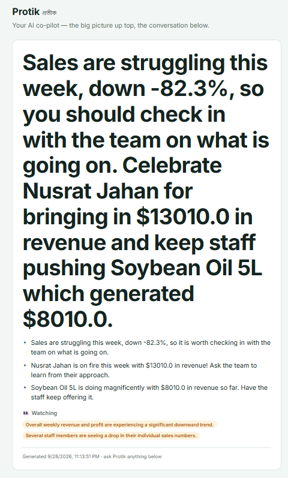
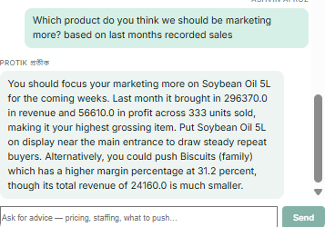
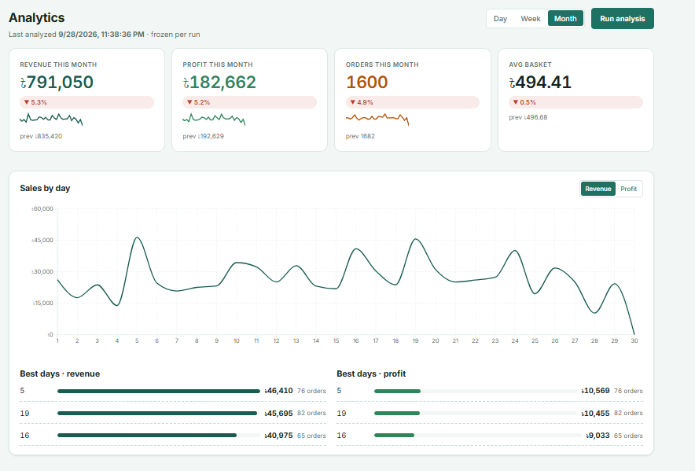
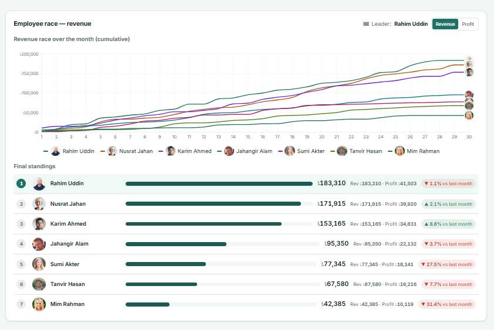
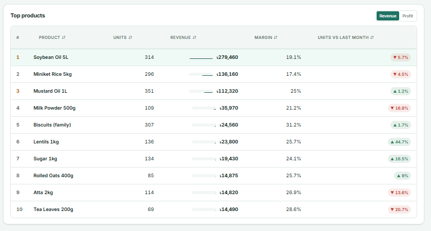

<!-- ======================================================================
     BANNER — place your banner image at docs/assets/banner.png and
     uncomment the block below. The two-linked-rings mark already exists
     as a React component (frontend/src/components/Logo.jsx); export it
     to PNG/SVG at ~1200x300 for a clean banner.

<p align="center">
  
</p>
====================================================================== -->

# Shongkho (সংখ্যা)

> **Numbers for the shop you run in your head.**
> A point-of-sale system with a built-in analytics engine and an AI advisor
> that answers only from your store's real data.


---

## The problem it solves

Ask a small shop owner in Dhaka how business is going and they'll tell you — from memory.
Which item sells fastest on Fridays, which employee actually moves stock, what's
gathering dust on the shelf: it's all in their head, or in a worn notebook. When
nothing is written down, nothing can be compared, questioned, or improved.

**Shongkho** (Bengali for "numbers") writes it down automatically at the point of
sale — fast checkout (cash/bKash/card), live inventory, per-employee logins so every
sale carries a name, and a WhatsApp-style group chat for the whole store. Then it does
the two things a notebook never could: turns the raw sales into a **one-click analytics
dashboard**, and lets the owner **ask questions in plain language** and get answers
grounded in the actual database.

## Screenshots & demo

### Protik — the AI advisor

Generative analysis: Protik summarizing what's happening in the store right now.

<p align="center">
  
</p>

Bilingual by design — the same advisor in English and in Bangla (mode: auto | বাংলা | EN):

<p align="center">
  
  
</p>

### Analytics — day / week / month, one click

Sales trend, the employee race, and top products — each frozen per analysis run.

<p align="center">
  
  
  
</p>

---

## Analytics — the numbers engine

The whole point of recording sales is being able to *read* them. One click on
**Run analysis** triggers the pipeline: three aggregators chew through the sales
history (revenue/profit/orders, per-employee performance, product rankings) and
freeze the results as timestamped snapshots per period — **day, week, or month**.

- **KPI strip** — revenue, profit, orders and average basket for the selected
  period, each with a delta against the previous period and a sparkline.
- **Sales trend** — the period bucketed into a series (hours for a day, days for a
  week, weeks for a month), with best-period callouts.
- **Employee race** — staff ranked by revenue or profit, including a
  race-over-time chart of who pulled ahead when.
- **Top products** — best sellers by revenue and by profit, with margin % and
  unit-movement deltas, plus the laggards.

Snapshots are **frozen per run** ("last analyzed" is stamped on every dashboard), so
what you see is always a consistent moment, never a half-updated mix. The executive
is pluggable: `ANALYTICS_EXECUTOR=sync` (default) runs the pipeline inside the
request with zero extra infrastructure; `celery` distributes it through Redis when a
store's history outgrows that. Everything lives under
`/api/v1/analytics/*` — `POST /run` (202, with 409 while a run is live), a
status endpoint for polling, and `GET /dashboard?period=…` for the assembled snapshot.

## Protik — the AI advisor

Protik (প্রতীক) is the part that makes the data *talk back*. The owner asks
questions in plain English, Bangla script, or Banglish —

> *"How did we do today?" · "Who is selling the most this week?" ·
> "Is Ghee 500g selling at all?" · "আগামী সপ্তাহে কোন পণ্যটা জোর দেওয়া উচিত?"*

— and Protik answers **from the store's database, not from its imagination**.
When Ghee 500g sat unsold for two weeks with 500 units on the shelf, Protik didn't
just report it — it suggested bundling or a front-shelf spot. Out-of-scope questions
("what's the weather?") get an explicit, persisted refusal, and prediction asks
("how much will we sell next month?") get an honest redirect. It never guesses.

### The grounding contract

The design rule underneath everything: **the LLM is never the source of a number.**

- **Closed tool registry.** Protik can't query the database freely — it calls one of
  three read-only tools (sales metrics, employee performance, top products) whose
  `store` scope is injected server-side from the session. It has **no write access**
  to any data, ever.
- **Pre-aggregated answers.** Tools return shaped buckets (daily/weekly/monthly
  resolution, hard 60-bucket ceiling), never raw rows — so a question can't become a
  data dump or an injection vector.
- **Bounded agent loop.** Max 5 tool rounds per question, max 20 assistant messages
  per store per day (counted in the DB, so it survives restarts).
- **Number verification.** Before any answer ships, every digit in it is checked
  against the tool results it claims to come from (each claim cites its `basis` — a
  dotted path into the data). Rounded values and simple derivations ("three
  employees declined") pass; a fabricated number matches nothing at any depth.
- **Deterministic fallbacks.** If a draft fails the check, it's discarded — the
  answer is re-synthesized directly from the verified tool payloads (numbers copied
  verbatim, checker-clean by construction) or replaced by an honest "I couldn't
  verify that." A wrong-but-confident answer never ships.
- **Degrade, don't fail.** No API key, a timeout, or a malformed response never
  costs the owner their charts — the analytics run still completes and Protik
  degrades to deterministic, number-checked summaries.

### Built for small models — on purpose

The accuracy comes from the plumbing, not from a bigger brain. Protik runs happily
on **Gemini Flash** (`gemini-3.5-flash-lite` by default — free-tier friendly) or
**fully locally on Ollama** (llama3.2, no cloud, no cost). The guardrail ladder
around small models is engineered, measured, and kept as a safety net on hosted
models: auto-fetch rescue when the model won't call a tool, wrong-domain and
vagueness gates so an answer must *name* real entities from the right dataset,
echo shields, placeholder-arg sanitization, and deterministic synthesis as the last
rung.

**Verified, not vibes.** A 22-question battery (`basic_questions_battery.py`) runs
against the live provider with deterministic per-answer verdicts — **22/22 PASS** on
`gemini-3.5-flash-lite` — and the eval harness tracks grounding (100%),
fabricated-number leakage (**0**), tool-selection accuracy (100%), and
over-refusal (0) across 13 scenario families.

### Bangla, natively

Language mode is `auto | বাংলা | EN` — `auto` mirrors whatever the owner writes.
It's translation-at-the-model (native bilingual generation), never an MT layer, so
grounding drift can't compound. The deterministic layer speaks Bangla too (fallbacks,
refusals, synthesis templates), Bengali numerals (১৩৫০) are normalized before
verification so the checker sees them, and the dashboard's AI commentary is stored
per language as its own snapshot section.

## Tech stack

FastAPI + SQLAlchemy + Celery/Redis (Python 3.12) · React 18 + Vite + Recharts ·
TiDB Cloud (MySQL) or SQLite · Gemini or Ollama for the LLM step.
[Docker Compose](docs/DOCKER.md) included; the API talks to the SPA over same-origin
`/api/v1/*` with signed-cookie sessions.

## Getting started

**Prerequisites:** Python 3.12+, Node 20+, Git. (Docker optional. Windows/macOS/Linux all fine.)

```bash
# 1. Clone
git clone https://github.com/AshvinAA/Shongkho.git
cd Shongkho

# 2. Backend — create env, install, configure
cd backend
python -m venv .venv
source .venv/bin/activate            # Windows: .venv\Scripts\activate
pip install -r requirements.txt
cp .env.example .env                 # then edit .env:
#   TIDB_DATABASE_URL=sqlite:///./Shongkho_dev.db     ← easiest local start
#   (or point it at a TiDB/MySQL URL for the full experience)
#   SESSION_SECRET_KEY=some-long-random-string

# 3. Seed the demo store (owner, 7 staff, 24 products, ~11k sales, chat, Protik history)
python seed_demo_data.py

# 4. Run the API
python -m uvicorn main:app --reload  # → http://localhost:8000  (docs at /docs)
```

```bash
# 5. Frontend — second terminal
cd frontend
npm install
npm run dev                          # → http://localhost:5173
```

Log in with the demo accounts:

| Role | Phone | Password |
|------|-------|----------|
| Owner (Edwin Zaman) | `01711111100` | `shongkho123` |
| Employees (Rahim, Karim, Sumi, …) | `01711111101` – `01711111107` | `shongkho123` |

> **AI advisor:** set `LLM_PROVIDER=gemini` + `GEMINI_API_KEY=…` in `.env` for the
> hosted model, or `LLM_PROVIDER=ollama` to run locally for free. Without any key,
> Shongkho still works — Protik falls back to deterministic, number-checked
> summaries and the analytics engine is unaffected.
> **Analytics at scale:** `ANALYTICS_EXECUTOR=sync` (default) needs nothing extra;
> set it to `celery` with Redis for the distributed pipeline
> (see [docs/ANALYTICS_SETUP.md](docs/ANALYTICS_SETUP.md)).

## Usage examples

Everything the UI does is a plain REST call under `/api/v1`. The analytics + AI core:

```bash
# Log in (session cookie)
curl -c cookies.txt -X POST localhost:8000/api/v1/auth/login \
  -H "Content-Type: application/json" \
  -d '{"phone_number": "01711111100", "password": "shongkho123"}'

# Ring up a sale: 2x product #1, cash (prices come from the DB, never the client)
curl -b cookies.txt -X POST localhost:8000/api/v1/checkout/ \
  -H "Content-Type: application/json" \
  -d '{"payment_method": "cash", "items": [{"product_id": 1, "quantity": 2}]}'

# Run the weekly analysis, then read the frozen snapshot dashboard
curl -b cookies.txt -X POST localhost:8000/api/v1/analytics/run \
  -H "Content-Type: application/json" -d '{"period": "week"}'
curl -b cookies.txt "localhost:8000/api/v1/analytics/dashboard?period=week"

# Ask Protik something — every number in the reply is verified against the DB
curl -b cookies.txt -X POST localhost:8000/api/v1/analytics/chat \
  -H "Content-Type: application/json" \
  -d '{"message": "Who is selling the most this week?", "language": "auto"}'
```

Interactive API docs live at `http://localhost:8000/docs` while the server runs.

## Testing

Both suites are hermetic — the backend pins a throwaway SQLite database before the
app imports, and the LLM is an injectable dependency (tests use a `FakeLLM`; no
network, no key). The AI layer additionally has live batteries and an eval harness
(see Protik above).

```bash
cd backend && python -m pytest tests/ -q     # 300 tests
cd frontend && npm test                      # 46 tests
```

## Roles

| Ability                          | Owner | Employee |
|----------------------------------|:-----:|:--------:|
| Browse products / customers      | ✅    | ✅       |
| Checkout (POS) / quick-add       | ✅    | ✅       |
| Store group chat                 | ✅    | ✅       |
| Protik AI advisor & analytics    | ✅    | ❌       |
| Product create/update/delete     | ✅    | ❌       |
| Stock adjustments                | ✅    | ❌       |
| Customer directory + spend       | ✅    | ❌       |
| Employee roster / performance    | ✅    | ❌       |
| Sales reports                    | ✅    | ❌       |

## Design notes

- **Prices are server-side.** Checkout payloads carry only product ids and
  quantities; the backend reads authoritative prices from the database.
- **Atomic checkout.** Stock validation, deductions, and the sale record
  commit in a single transaction; any failure rolls everything back.
- **Sessions are re-validated** against the database on every request, so
  deleted accounts are immediately locked out.
- **The LLM never touches a transaction.** Network calls never happen inside a DB
  transaction, and no LLM output is ever written to the database as fact.

## Documentation

- [LLM integration](docs/LLM_INTEGRATION.md) — **the full Protik architecture**: grounding contract,
  basis-citation checker, rescue ladder, language modes, and the complete guardrail checklist
- [Analytics setup](docs/ANALYTICS_SETUP.md) — sync vs Celery executor, Redis on Windows
- [Protik Bangla plan](docs/PROTIK_BANGLA_PLAN.md) — the bilingual design decisions
- [TiDB Cloud setup](docs/TIDB_CLOUD_SETUP.md) — migration & TLS configuration
- [Docker](docs/DOCKER.md) — containerized stack (backend + nginx frontend)
- [UI audit](docs/UI_AUDIT.md) — the design-token system behind the interface

## Contributing

This started as a project to solve a real problem, and it grows because people poke
holes in it. If Shongkho would help your shop — or you can see something missing —
that's exactly the feedback wanted:

-  Found a bug? Open an issue with steps to reproduce.
-  Idea (big or small)? Issues and discussions are open.
-  Code? PRs are welcome — run both test suites before submitting, and keep PRs focused.

## License

Released under the [MIT License](LICENSE) — free to use, modify, and build on,
with attribution. <!-- TODO: add the LICENSE file itself (one-liner: the standard
MIT text, Copyright (c) 2026 <your name>) — the README link above points to it. -->
